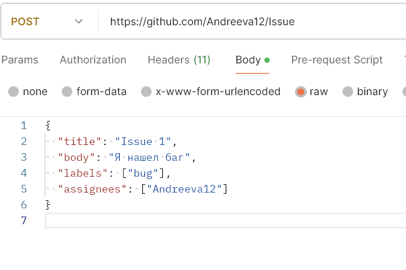
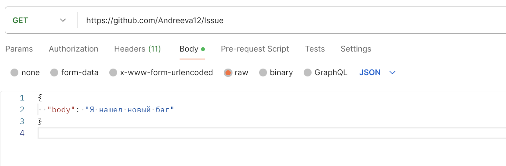
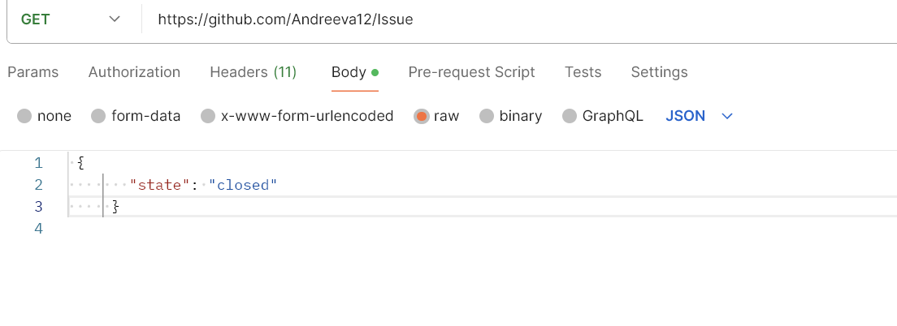

# GitHub Issues Management

Нужно написать тестовые сценарии(UI и API) по предложенному ниже сценарию:

· Создать issue с названием "Issue 1" и описанием "Я нашел баг". У этой
issue должен быть label "bug", и assignee - вы (текущий логин на
GitHub/GitLab).
· Проверить, что тестовая запись создалась и она есть в списке Issues.
· Отредактировать описание "Issue 1" на "Я нашел новый баг".
· Удалить "Issue 1"(или залочить).

###Этот проект демонстрирует создание, проверку, редактирование и удаление issue на GitHub с использованием Postman и UI.

## Шаги, выполненные с использованием Postman

### Создание issue

1. **Настройка метода и URL:**
   - Метод: `POST`
   - URL: `https://api.github.com/repos/Andreeva12/issues`

2. **Добавление заголовков:**
   - Key: `Authorization`, Value: `token ...`
   - Key: `Accept`, Value: `application/vnd.github.v3+json`

3. **Настройка тела запроса:**
   -  "Body", затем  "raw" и "JSON".
   - 
     ```json
     {
       "title": "Issue 1",
       "body": "Я нашел баг",
       "labels": ["bug"],
       "assignees": ["Andreeva12"]
     }
     ```

4. **Отправка запроса:**
   -  "Send", что запрос выполнен успешно и issue создано.
  
  ###  

### Проверка issue

1. **Создание нового запроса:**
   - Метод: `GET`
   - URL: `https://api.github.com/repos/Andreeva12/YOUR_REPO/issues`

2. **Добавление заголовков:**
   - Key: `Authorization`, Value: `token ...`
   - Key: `Accept`, Value: `application/vnd.github.v3+json`

3. **Отправка запроса:**
   -  "Send" и issue отображается в списке.

### Редактирование issue

1. **Создание нового запроса:**
   - Метод: `PATCH`
   - URL: `https://api.github.com/repos/Andreeva12/YOUR_REPO/issues/ISSUE_NUMBER`

2. **Добавление заголовков:**
   - Key: `Authorization`, Value: `token YOUR_GITHUB_TOKEN`
   - Key: `Accept`, Value: `application/vnd.github.v3+json`

3. **Настройка тела запроса:**
   -  "Body",  "raw" и "JSON".
   - 
     ```json
     {
       "body": "Я нашел новый баг"
     }
     ```

4. **Отправка запроса:**
   -  "Send"  описание issue обновлено.
  
  ###  


### Удаление issue

1. **Создание нового запроса:**
   - Метод: `PATCH`
   - URL: `https://api.github.com/repos/Andreeva12/YOUR_REPO/issues/ISSUE_NUMBER`

2. **Добавление заголовков:**
   - Key: `Authorization`, Value: `token YOUR_GITHUB_TOKEN`
   - Key: `Accept`, Value: `application/vnd.github.v3+json`

3. **Настройка тела запроса:**
   -  "Body", затем выберите "raw" и "JSON".
   - 
     ```json
     {
       "state": "closed"
     }
     ```

4. **Отправка запроса:**
   - "Send"  issue закрыто.
  
  ### 


